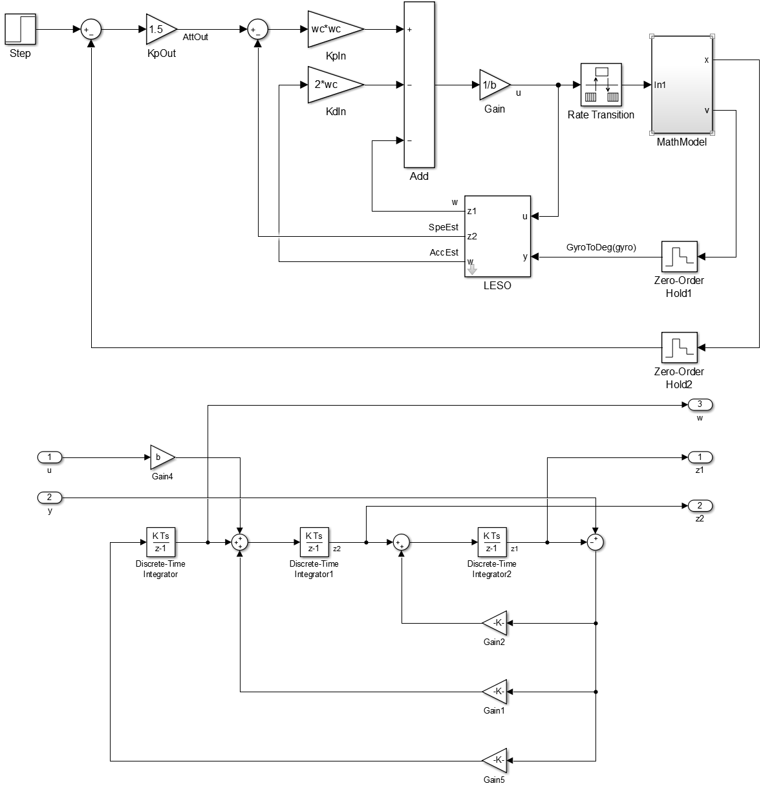

# 小四轴飞控

         HEAD
	 M2    ↑     M3

	   \         /

	     \     /

	       \ /

	       / \

	     /     \

	   /         \

	 M1          M4

电机M1至M4分别为逆顺逆顺。

默认为姿态模式,可通过地面站进行更改。

[地面站](https://github.com/xd15zhn/GroundStation/releases)

# 代码说明

version V1.05

### 用户代码
尽量不改动自动生成的代码文件，用户添加的代码文件在user文件夹中，与自动生成的代码文件分离。  
自动生成的代码文件中加入的用户代码包括:  
1. main.c:初始化,死循环,定时器3任务调度  
2. main.h:数据类型定义,如u8,u16,u32等;IO端口定义,如LED1_PORT,STAT_PORT等  
3. adc.c:测电池电压函数  
用户代码文件中存在的底层代码包括:  
1. mpuiic.c mpuiic.h:  
2. protocol.c:串口发送和接收完成回调函数  

### 变量/函数/宏定义命名格式
变量:全部小写或首字母大写 xxx/Xxx/XxxXxx  
函数:首字母大写加下划线分隔 Xxx_Xxx()  
宏定义:全部大写加下划线分隔 XXX_XXX  

### 控制链路
控制协议见 https://github.com/xd15zhn/GroundStation

锁定与解锁均需要上位机发送正确的指令。

起飞后（即油门超过一定值）2秒内未接收到正确的遥控信号或飞机姿态倾角过大，将进入失控保护模式尝试平稳降落，
长时间未收到信号则关闭油门。重新收到信号或姿态恢复正常则可随时恢复控制。

解锁后2秒内未接收到正确的遥控信号自动锁定。

起飞前建议进行传感器校准。

### 控制框图

注：图中的控制器相关的增益参数非实际值，仅供参考。

内环控制频率500Hz，外环控制频率100Hz。

每个通道的控制器关键运行参数范围大致如下(一般在范围内，不排除超过范围的可能):

控制器输出u:±  
角速度(°/s)gyro:±1000  
角加速度(°/s^2)AccEst±1000  
总扰动w:±  

### 版本更新
V1.05更新内容

* 将控制器改为标准线性ADRC  
* 为避免控制器输出发散，控制器只有超过怠速油门后才正常工作  
* 速度模式下侧翻不会锁定

此版本未通过飞行测试。